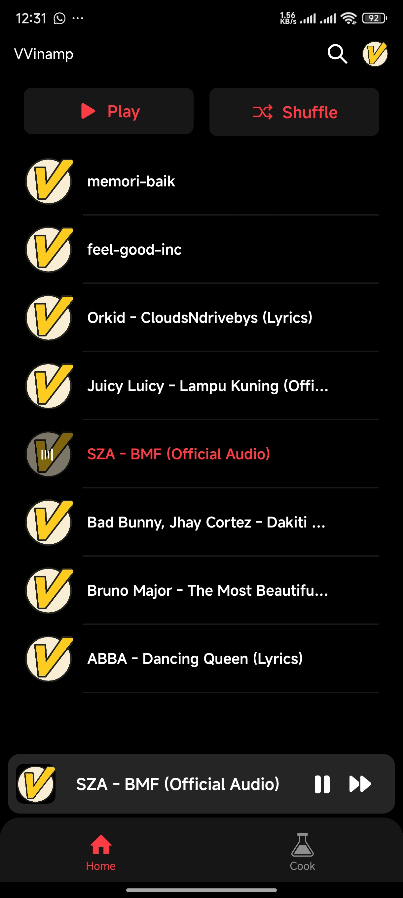
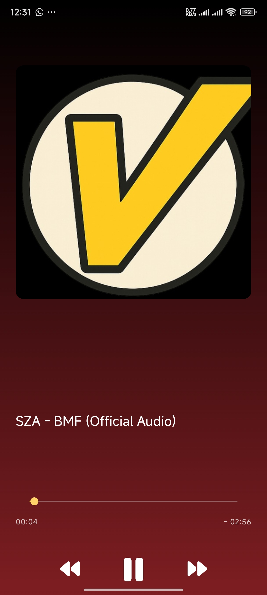
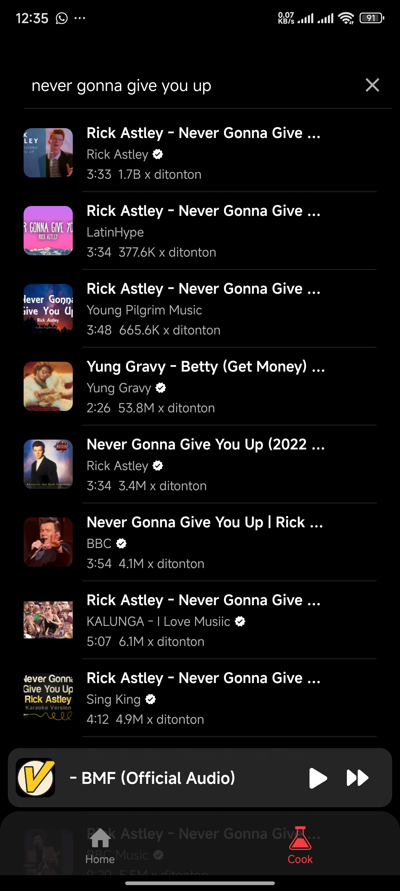
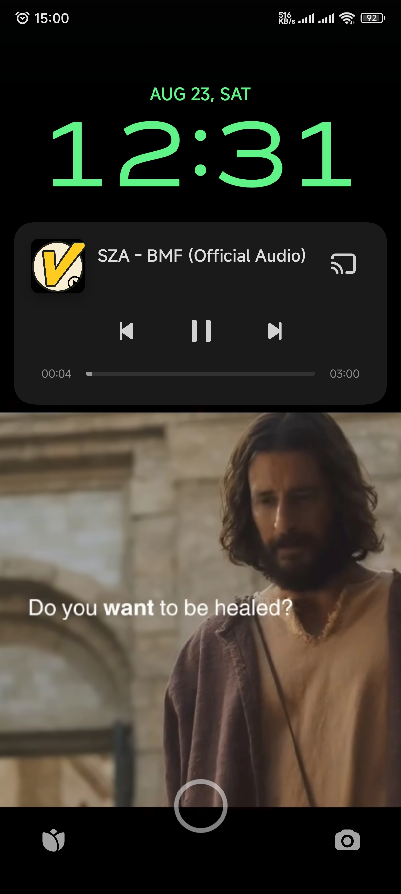

<div align="center">
  
</div>


# Welcome to VVinamp 👋

A mobile app for searching, downloading, and streaming YouTube audio, built with Rust backend and Expo React Native frontend. Features include background playback, progress tracking, and adaptive streaming.


## 🌃 Features

- 🚫 No ads, thanks to the use of public & free music metadata providers and YT Music APIs
- 🖥️ 📱 Cross mobile platform support
- 🪶 Small size & less data usage
- 🕵️ Anonymous/guest login
- 🚀 Native performance
- 📖 Open source/libre software

### ❌ Unsupported features
- ⬇️ **Freely downloadable tracks** [Coming soon!]

## 🛠️ Tech Stack
Backend: Rust (yt-dlp, ffmpeg integration), PostgreSQL
Frontend (Mobile): Expo (React Native), React Native Track Player
Web (Utility): Next.js (progress page, track management)
Protocols: HLS streaming (.m3u8, .ts)

## 🌃 Documentary


    
[](https://www.youtube.com/watch?v=Y72UgkygvHI)

## 🔧 How It Works
1. User searches for a track in the mobile app.
2. The backend uses yt-dlp to fetch & download the audio.
3. The audio is converted into HLS segments using ffmpeg.
4. Conversion progress is tracked and displayed via API/web.
5. Once stored in the backend, the track is added to the PostgreSQL database.
6. Mobile app fetches the updated track list from backend.
7. When the user plays a track, the app streams it using HLS protocol with full background support.

## 🎯 Learning Goals
- Explore Rust backend development for media processing.
- Learn video/audio handling with yt-dlp + ffmpeg.
- Implement adaptive streaming (HLS) in a mobile app.
- Integrate background playback and notification controls with React Native.
- Build an end-to-end media pipeline from search → download → convert → stream.

## Get started

1. Install dependencies

   ```bash
   npm install
   ```

2. Start the app

   ```bash
   npx expo run:android
   ```

#### Prerequisite
**commandlinetools** -> android sdk contains build tools, platform tools, and API need to compile ``

```
# sdkmanager
brew install --cask android-commandlinetools

# Accept all licenses first
sdkmanager --licenses

# Install all required Android components
sdkmanager "platforms;android-34"
sdkmanager "build-tools;34.0.0"
sdkmanager "platform-tools"
sdkmanager "cmdline-tools;latest"
sdkmanager "ndk;26.1.10909125"
```

#### zshrc adjustment
```
export ANDROID_HOME=/opt/homebrew/share/android-commandlinetools
export ANDROID_SDK_ROOT=$ANDROID_HOME
export PATH=$PATH:$ANDROID_HOME/cmdline-tools/latest/bin
export PATH=$PATH:$ANDROID_HOME/platform-tools
export PATH=$PATH:$ANDROID_HOME/build-tools/34.0.0

export JAVA_HOME=/opt/homebrew/opt/openjdk@17
export PATH=$PATH:$JAVA_HOME/bin

export NDK_HOME=$ANDROID_HOME/ndk/26.1.10909125

export PATH=$PATH:$NDK_HOME/toolchains/llvm/prebuilt/darwin-x86_64/bin
```


## Command Line

``npx expo prebuild -p android --clean`` prebuild the android after add some deps or code touch native


``npx expo run:android`` run the app to android, which use device already connect to adb


```
adb pair 192.168.1.9:33757 -> pair with wireless debugging and put some auth after that
adb devices -l -> list of devices connected
adb push build-1752600101742.apk /sdcard/Download/ -> push apk build to android detected
```

## Config


``"newArchEnabled": false,`` in eas.json to tell the gradle not using newArchEnabled because react-native-track-player (RTNP) not supported it

``
{
    "android": {
        "usesCleartextTraffic": true
    }
}
`` on app.json to support http not only https

```
#eas.json

    "preview": {
      "distribution": "internal",
      "android": {
        "buildType": "apk"
      }
    },
```
``eas build --platform android --profile preview --local`` will build local apk with preview profile on eas.json


